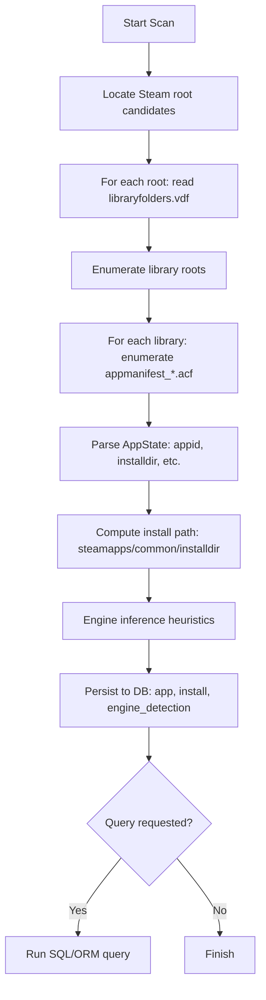
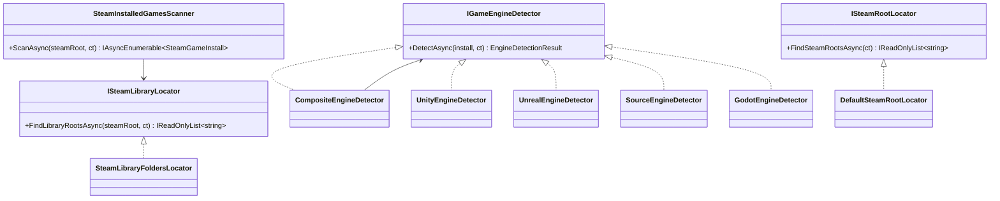

# Building a C# Steam Game Catalog Constructor with Engine Detection and Database Storage

## Executive summary

This report describes how to build a **C# “catalog constructor”** (an orchestrating component whose constructor wires together detectors, parsers, and storage) that can **detect installed games managed by the Steam client, extract install metadata, infer game engine family via local heuristics, store results in a database, and support queries**. The design prioritizes **local, file-based discovery** (Steam library folders + appmanifest files) because official public APIs generally model **ownership**, not **installation** state. citeturn7search1turn0search2turn0search4

Key conclusions:

- **Most reliable installed-game detection (consumer-side)**: enumerate **Steam library roots** from `libraryfolders.vdf`, then enumerate `steamapps/appmanifest_*.acf` to discover installed AppIDs and their `installdir`, and map that to `<library>/steamapps/common/<installdir>` paths. citeturn7search1turn8search2  
- **Engine identification is inherently heuristic**. Strong, broadly applicable signals include build-output artefacts such as: **Unity** (`UnityPlayer.dll`, `<ProjectName>_Data`, `GameAssembly.dll`), **Unreal** (`*.pak` in Content/Paks), **Source** (`*.vpk`), **Godot** (`data.pck`). citeturn3search2turn3search17turn2search10turn2search3turn2search2turn2search5  
- **Legal / policy boundaries matter**: avoid implying affiliation with entity["company","Valve Corporation","video game company"], avoid using Steam branding in a way that suggests endorsement, and treat reverse-engineering restrictions and per-game EULAs seriously—especially if you distribute the tool. citeturn9search2turn0search0turn9search20  
- **Recommended stack (March 2026)**: **.NET 10 LTS** (active support) with modern hosting/DI patterns, a repository layer using **parameterized SQL** (Dapper) or EF Core, and schemas for **SQLite** (local, embedded) and **PostgreSQL** (multi-user / service). citeturn4search0turn6search13turn5search10turn5search15turn4search1turn6search0  

Unspecified details (explicitly): you did not specify whether the tool is for **personal use vs. commercial distribution**, whether it must run as a **desktop app vs. service**, whether engine detection must be **explainable** (audit trail) or just an output label, and whether you require **Steam Deck / Proton** awareness beyond basic folder discovery.

A reference codebase (source only) is included as a downloadable ZIP:

[Download the SteamGameCatalog reference repository (ZIP)](sandbox:/mnt/data/SteamGameCatalog.zip)

## Legal, permissions, and Steamworks constraints

### What you can do without Steamworks

A local scanner that reads **files on disk** (Steam library configuration + manifests + selected game artefacts) typically needs only **standard user read permissions**. On Windows, reading Steam’s per-user registry keys (HKCU) also typically requires no elevation. citeturn1search0turn7search1

### Steam Subscriber Agreement and “reverse engineering” risk

The Steam Subscriber Agreement includes restrictions that can be relevant if your tool crosses into **reverse engineering** territory (for example: disassembling binaries, circumventing protections, or modifying client behaviour). Even if your approach is purely “read file names and standard build outputs,” you should treat engine detection by binary scanning (strings/signatures) as *potentially closer to reverse engineering* than simple manifest parsing—particularly when distributing the tool. citeturn0search0

### Steamworks SDK and distribution/licensing constraints

If you considered using Steamworks to query installation state, note: Steamworks is primarily for **Steam partners**, and incorporating Steamworks SDK components may introduce **redistribution and compatibility constraints**. Steamworks documentation warns that the Steamworks SDK is not compatible with some open-source licences, and it discusses constraints around distributing open source applications on Steam. citeturn0search5

Practical implication: for a general-purpose “inventory my installed Steam games” utility, you should **avoid Steamworks SDK dependencies** unless you are a partner and have a clear contractual basis.

### Branding and trademarks (if you ship a tool)

If you distribute the tool, marketing and UI should avoid implying Steam endorses or affiliates with the project. Steam branding guidelines state that the Steam logo/trademarks must not be used in a way that implies non-Valve materials are sponsored/endorsed/affiliated, and include specific guidance for attribution. citeturn9search2turn9search20

### Permissions matrix (high-level)

- **Windows**: read access to `%ProgramFiles(x86)%\Steam` (or custom), read access to Steam libraries, HKCU registry read. Usually no admin needed for read-only inspection. citeturn1search0  
- **Linux**: default paths are under the user’s home; Flatpak installs add sandbox considerations and may require explicit permission to access additional drives. citeturn7search1turn8search2  
- **macOS**: Steam data commonly lives under `~/Library/Application Support/Steam`, but this is not strongly standardized in official Steam public docs; treat as best-effort and verify on target systems. citeturn8search1turn8search11  

## Detecting installed Steam games

### Detection methods compared

| Method | What it detects | Installed accuracy | Permissions | Complexity | Cross-platform | Notes |
|---|---|---:|---|---:|---:|---|
| Steam library folders + appmanifest (`libraryfolders.vdf` + `appmanifest_*.acf`) | Libraries + installed AppIDs + `installdir` | **High** | Read-only filesystem | Medium | Yes | Steam recognition commonly depends on an appmanifest in `steamapps/`, and `installdir` maps to `steamapps/common/…`. citeturn7search1turn8search2 |
| Direct folder enumeration of `steamapps/common` | Presence of folders | Medium | Read-only filesystem | Low | Yes | Loses AppID mapping; folder names don’t reliably identify games. |
| Windows registry keys for Steam root | Where Steam installed (Windows) | N/A (enabler) | HKCU/HKLM read | Low | No | Useful to find Steam root quickly; HKCU `"SteamPath"` is documented in community Valve wiki content. citeturn1search0 |
| Windows shortcuts / URI links (`steam://…`) | Launch targets, AppIDs | Low–Medium | Read-only filesystem | Medium | No | Shortcuts can be stale; not a reliable “installed” signal. Steam browser protocol exists but doesn’t guarantee installation. citeturn0search3 |
| Steam Web API “owned games” | Ownership library | **Not installed** | Network + API key | Medium | Yes | Returns owned titles (subject to privacy settings), not local install state. citeturn0search2turn0search4 |
| Steamworks / client integration | Potentially richer internal state | Varies | Likely partner-only + constraints | High | Yes | Typically unsuitable for general consumer tools; prefer local inspection unless you have partner basis. citeturn0search5turn0search0 |

### Recommended detection pipeline (file-based)

The most defensible approach for “installed games” is:

1. Find **Steam root(s)**  
   - Windows: registry + fallbacks. citeturn1search0  
   - Linux: commonly `~/.local/share/Steam` plus symlinks like `~/.steam/root`. citeturn7search1turn8search2  
   - macOS: commonly `~/Library/Application Support/Steam`. citeturn8search1turn8search11  

2. Parse `libraryfolders.vdf` to enumerate each **library root**.

3. For each library root, enumerate `steamapps/appmanifest_*.acf`:
   - Parse KeyValues to read at least `appid` and `installdir`.
   - Map to install path: `<library>/steamapps/common/<installdir>`. citeturn7search1turn8search2  

4. Record scan observations, including errors and partial results.

### Workflow diagram



### Appmanifest parsing (KeyValues) example

Steam appmanifest files use the Valve “KeyValues” text format (commonly used in Steam config/manifests). On Linux, documentation-oriented community sources describe that Steam recognizes games via `appmanifest_<AppId>.acf` in `steamapps/`, and that `installdir` determines the directory name under `steamapps/common`. citeturn7search1turn8search2

Example C# snippet (from the included reference repository) to parse the AppState block:

```csharp
var doc = KeyValuesTextParser.Parse(manifestText);
var appState = doc.Get("AppState") ?? doc.Get("appstate");
if (appState is null) throw new FormatException("Missing AppState");

int appId = int.Parse(appState.GetString("appid")!);
string? installDir = appState.GetString("installdir");
long? sizeOnDisk = appState.GetInt64("SizeOnDisk");
int? stateFlags = appState.GetInt32("StateFlags");
```

## Identifying game engine type

### Why engine detection is hard

Games frequently ship with:
- mixed tooling (launchers, anti-cheat, crash reporters),
- renamed folders/binaries,
- proprietary packaging even when based on an engine,
- “engine forks” (e.g., Unreal forks) that retain artefacts but alter identifiers.

So an engine label should be stored with:
- **confidence score**, and
- **evidence list** (file paths/signatures) for explainability.

### High-signal artefacts (recommended first-pass heuristics)

The following heuristics are strongly supported by primary documentation about build outputs and packaging formats:

- **Unity**  
  Unity’s Windows standalone build output typically includes:
  - `UnityPlayer.dll`
  - `<ProjectName>_Data` folder  
  Unity IL2CPP builds typically also include `GameAssembly.dll`. citeturn3search2turn3search17  

- **Unreal Engine**  
  Unreal packaged builds commonly rely on **Pak files** (`*.pak`) and documentation repeatedly references “pak files” as packaged content output. citeturn2search1turn2search10turn2search7  

- **Source / Source 2**  
  Valve PacK (`.vpk`) is a documented package format used by Source engine games and Source 2. citeturn2search3turn2search6  

- **Godot**  
  Godot’s export process can create a `data.pck` file bundled with an optimized binary; Godot documentation describes the `.pck` mechanism and exporting. citeturn2search2turn2search5  

### Secondary techniques (use carefully)

- **Binary string scanning** (low confidence): search executables/libraries for “UnityPlayer”, “Unreal Engine”, “Godot Engine”, etc. This is often brittle, potentially costly, and may be closer to reverse-engineering than file-name heuristics. (If you use it, gate behind a setting and store only minimal results.) citeturn0search0  
- **DLL presence**: e.g., `UnityPlayer.dll` is a very strong Unity indicator on Windows. citeturn3search2  
- **Package format / directory layout**: `.vpk`, `.pak`, `.pck` are stronger than folder names alone. citeturn2search3turn2search10turn2search5  
- **Third-party metadata sources** (optional enrichment):  
  - entity["organization","IGDB","video game database"] can provide engine metadata for titles, but requires API access and has its own terms (not covered in detail here because you requested prioritization of Valve/.NET primary sources). Use external metadata only as a **secondary** source and store provenance.

### Engine detector structure diagram



## Database schemas for SQLite and PostgreSQL

### Goals, trade-offs, and rationale

A robust schema for this use case should:

- preserve stable identifiers (**Steam AppID** as the primary external key),
- separate “app identity” from “installation observation” (because installs can move),
- store engine detection as a **result with evidence**, not a single mutable field,
- support queries like “all Unity games installed on this machine” efficiently.

SQLite is suitable for **local inventory** and “single-user on one machine.” PostgreSQL is appropriate if you build a **service** (multi-user, multi-host scans, dashboards). EF Core supports multiple providers via plug-ins; SQLite provider is maintained as part of EF Core, while PostgreSQL often uses entity["organization","Npgsql","dotnet data provider project"]’s provider ecosystem. citeturn5search12turn5search2turn6search1turn6search0

### Proposed normalized schema (both engines)

Core tables:

- `steam_app`: one row per AppID; stores display name and “first/last seen”
- `steam_install`: one row per AppID per library root; stores install path and manifest path
- `engine_detection`: one row per AppID per library root; stores engine family, confidence, evidence JSON, detector identity/version

Indexing:

- `engine_detection(engine_family)` for “show me all Unity installs”
- `steam_install(install_path)` for “find by path” or deduplication

The included repository ships two DDL scripts:

- `schema-sqlite.sql` (SQLite)
- `schema-postgresql.sql` (PostgreSQL)

### Parameterized write pattern

For safety and correctness, all inserts/updates should be **parameterized**. Dapper’s documentation describes parameterized queries using anonymous objects and supports safe parameterization patterns. citeturn5search15turn10search2

Example **SQLite upsert** (Dapper):

```csharp
await connection.ExecuteAsync(
"""
INSERT INTO engine_detection(
  steam_appid, library_root, engine_family, confidence, evidence_json, detector_name, detector_version, detected_at_utc)
VALUES(
  @steam_appid, @library_root, @engine_family, @confidence, @evidence_json, @detector_name, @detector_version, @detected_at_utc)
ON CONFLICT(steam_appid, library_root) DO UPDATE SET
  engine_family = excluded.engine_family,
  confidence = excluded.confidence,
  evidence_json = excluded.evidence_json,
  detector_name = excluded.detector_name,
  detector_version = excluded.detector_version,
  detected_at_utc = excluded.detected_at_utc;
""",
new { /* parameters */ },
transaction: tx
);
```

SQLite ADO.NET provider (`Microsoft.Data.Sqlite`) is a lightweight provider and is commonly used directly or via EF Core. citeturn4search1

### Query pattern

Example query: “list all Unity installs” (works in both engines with minor type differences):

```sql
SELECT
  i.steam_appid,
  a.display_name,
  i.install_path,
  e.engine_family,
  e.confidence
FROM engine_detection e
JOIN steam_install i
  ON e.steam_appid = i.steam_appid AND e.library_root = i.library_root
JOIN steam_app a
  ON a.steam_appid = i.steam_appid
WHERE e.engine_family = 'Unity'
ORDER BY COALESCE(a.display_name, CAST(i.steam_appid AS TEXT));
```

## C# design and implementation patterns

### Recommended “constructor” approach

A clean way to interpret “Method Constructor” here is a **composition root**: a class (or top-level DI registration) whose constructor receives the pluggable components and whose `RunAsync()` method orchestrates:

1. locate Steam roots
2. scan installed games
3. detect engine
4. persist
5. query

This keeps engine detectors and storage interchangeable and makes the system unit-testable.

### Async patterns

Use:

- `IAsyncEnumerable<T>` for filesystem enumeration (streaming results, early exit)
- `CancellationToken` everywhere
- bounded concurrency for heavy work (engine scanning) if needed

The included reference repository scanner uses `IAsyncEnumerable<SteamGameInstall>` so you can start persisting results as they’re found rather than buffering thousands of records.

### Dependency injection and hosting

For modern .NET, use the Generic Host + DI:

- `Host.CreateApplicationBuilder(args)` for new codebases (recommended in current templates)
- register services via `builder.Services.AddSingleton(...)` etc. citeturn6search13turn5search10

.NET 10 is the current LTS as of March 2026 with active support, so it’s a sensible baseline for new tooling. citeturn4search0

### Error handling strategy

Recommended approach:

- **Never fail the whole scan** because one library or manifest is malformed.
- For each “unit of discovery” (root → library → manifest):
  - catch and record parsing errors,
  - continue scanning other units.
- Store an optional “scan run” record if you need auditable runs (not implemented in the minimal schema here).

### Unit-testable components

Structure components so that they accept abstractions:

- file system abstraction (interface) for in-memory tests
- registry provider abstraction for Windows registry reads (optional; not included in minimal repo)
- stateless parsers (KeyValues) for deterministic behaviour

## Security, performance, privacy, cross-platform, and distribution

### Security and privacy

- Treat the installed-games list as **sensitive personal data** (it can reveal preferences, age ratings, etc.).  
- Minimize collection: store AppID + install path + coarse engine family, and avoid collecting per-user identifiers (SteamID) unless explicitly required.
- Use parameterized queries everywhere (Dapper/EF Core) to prevent SQL injection when any user-provided filters exist. citeturn5search15turn4search1

### Performance guidance

- Prefer parsing manifests over deep directory crawling; `appmanifest_*.acf` gives you stable AppIDs and install directories quickly. citeturn7search1  
- Engine heuristics should short-circuit quickly (top-level file checks first), and only fall back to deeper scans if needed.
- If you later add binary scanning, cap read sizes (e.g., first 8–16 MiB) and make it opt-in.

### Cross-platform notes and limitations

- Linux: default Steam root is frequently `~/.local/share/Steam`, with `~/.steam/root` symlink patterns; Flatpak installations add sandbox constraints and can require explicit permissions to access other mounts/drives. citeturn7search1turn8search2  
- Windows: registry can speed up root discovery (HKCU `SteamPath`). citeturn1search0  
- macOS: Steam data is commonly cited under `~/Library/Application Support/Steam`, but you should treat this as best-effort and verify on your target machines before claiming universal support. citeturn8search1turn8search11  

### Packaging and distribution

**Build/distribution recommendations:**

- Provide both **framework-dependent** and **self-contained** binaries.
- Consider **single-file publishing** for CLI tools; .NET documentation describes `PublishSingleFile`, `SelfContained`, and `RuntimeIdentifier` usage. citeturn9search19  
- If you publish on entity["company","GitHub","code hosting platform"], use Releases to attach built artefacts; GitHub’s documentation covers how Releases and release assets work (including size/asset limits). citeturn9search13turn9search1turn9search5  
- Include an explicit `LICENSE` file at the repository root (GitHub recommends this as a best practice). citeturn9search16turn9search4  

**Why this report does not include an actual GitHub Release link:** this environment cannot publish to external hosting services directly, so the deliverable is provided as a ZIP download above. The repository includes a ready-to-push structure and build instructions in `README.md`; you can create a GitHub repository and attach `dotnet publish` outputs to a Release following GitHub’s docs. citeturn9search13turn9search5  

**Steam branding caution:** if you name or brand the tool publicly, ensure it doesn’t imply endorsement/affiliation; follow Steam branding guidelines and attribution requirements. citeturn9search2turn9search20